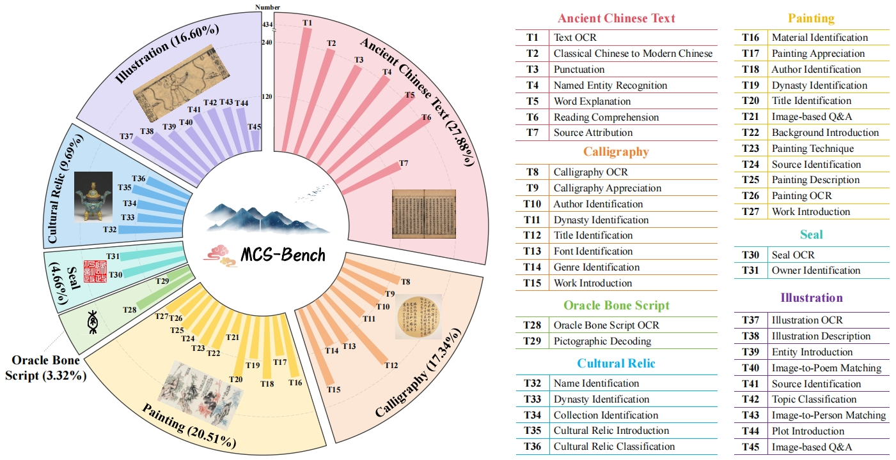
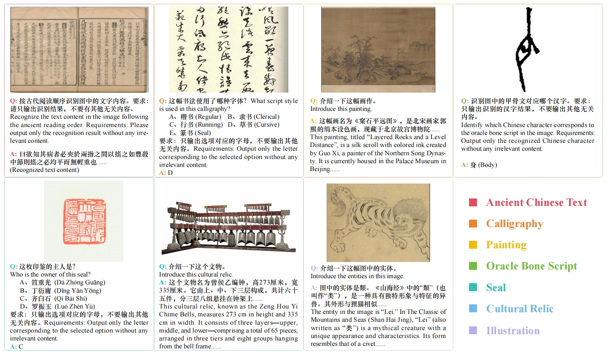
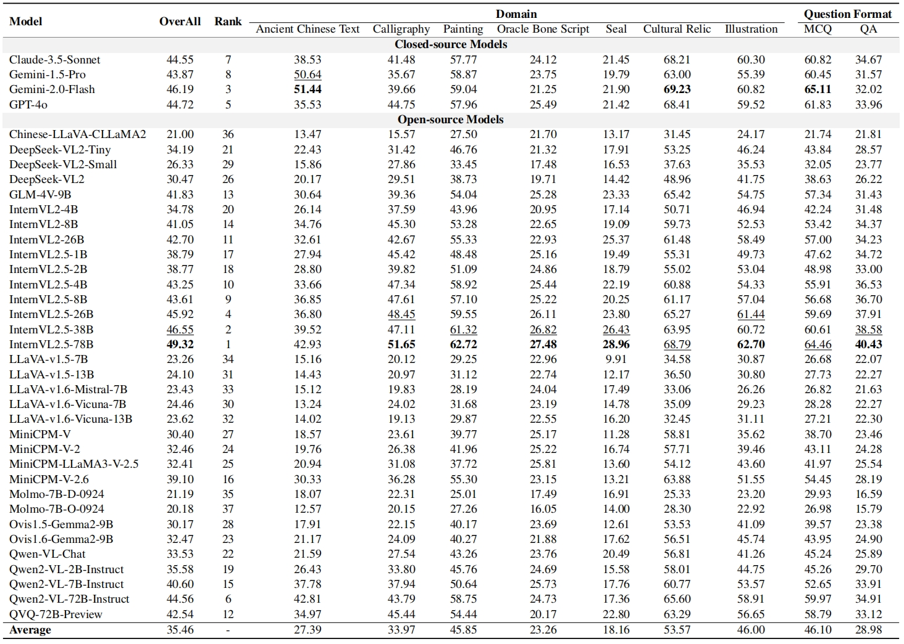
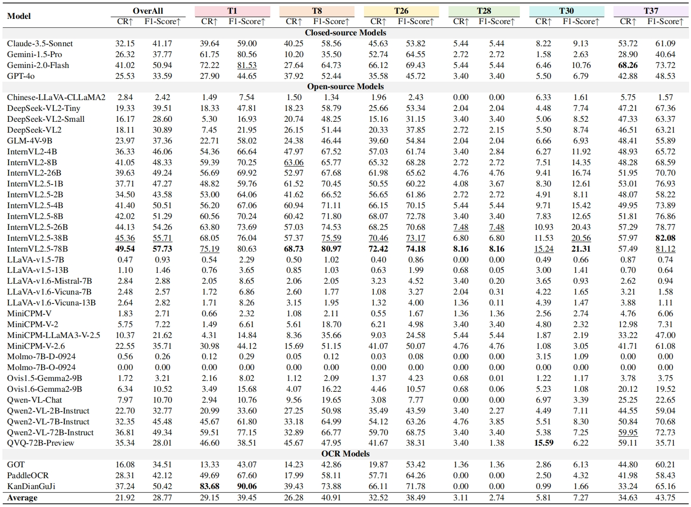

<h1>
  
  MCS-Bench
</h1>


## Introduction

With the rapid development of Multimodal Large Language Models (MLLMs), their potential in **Chinese Classical Studies (CCS)**, a field which plays a vital role in preserving and promoting China’s rich cultural heritage, remains largely unexplored due to the absence of specialized benchmarks. To bridge this gap, we propose **MCS-Bench**, the first-of-its-kind multimodal benchmark specifically designed for CCS across multiple subdomains. MCS-Bench spans seven core subdomains (***Ancient Chinese Text***, ***Calligraphy***, ***Painting***, ***Oracle Bone Script***, ***Seal***, ***Cultural Relic***, and ***Illustration***), with a total of **45** meticulously designed tasks. Through extensive evaluation of 37 representative MLLMs, we observe that even the top-performing model (InternVL2.5-78B) achieves an average score below 50, indicating substantial room for improvement. Our analysis reveals significant performance variations across different tasks and identifies critical challenges in areas such as Optical Character Recognition (OCR) and cultural context interpretation. MCS-Bench not only establishes a standardized baseline for CCS-focused MLLM research but also provides valuable insights for advancing cultural heritage preservation and innovation in the Artificial General Intelligence (AGI) era.

<div align="center">
  
</div>

<div align="center">
Figure 1: Overview of MCS-Bench, covering 7 subdomains and 45 fine-grained tasks.
</div>

## Data Examples

Figure 2 showcases examples from seven subdomains in MCS-Bench.

<div align="center">
  
</div>

<div align="center">
Figure 2: Data examples from MCS-Bench.
</div>

## Data Acquisition Method

The MCS-Bench dataset is only available for non-commercial research purposes. Scholars or organizations interested in using the MCS-Bench dataset are required to fill out this [application form](Application_Form_for_Using_MCS-Bench.docx) and send it to us via email. When submitting the application form, please list or attach 1-2 papers you have published in the past 6 years to demonstrate that you (or your team) are conducting research in the field of Classical Chinese Studies. Once we receive and approve your application, we will provide a download link and extraction password. All users must comply with the usage terms; failure to do so will result in the revocation of authorization.

## Inference

Calculate metrics based on the output of LLMs:
```
python calculate_metrics.py
```

## Evaluation Metrics

<div align="center">
Table 1: Results of 37 MLLMs on MCS-Bench. “MCQ” represents “Multiple-Choice Questions”; “QA” represents “open-ended Q&A”. Each score is the average of metrics across all corresponding tasks. Bold represents the best results, while underline represents the second best.
</div>

<div align="center">
  
</div>

<div align="center">
Table 2: Results of 37 MLLMs and 3 OCR models across six OCR tasks. Different colors represent different subdomains, with the color-domain mapping provided in Figure 1. In addition to CR, we also provide the F1-Score
metric. “Average” represents the average metric of 37 MLLMs. Bold represents the best results, while underline represents the second best.
</div>

<div align="center">
  
</div>

## License


The work is licensed under a [MIT License](https://lbesson.mit-license.org/).


The dataset is licensed under a [Creative Commons Attribution-NonCommercial-ShareAlike 4.0 International License](https://creativecommons.org/licenses/by-nc-sa/4.0/).

